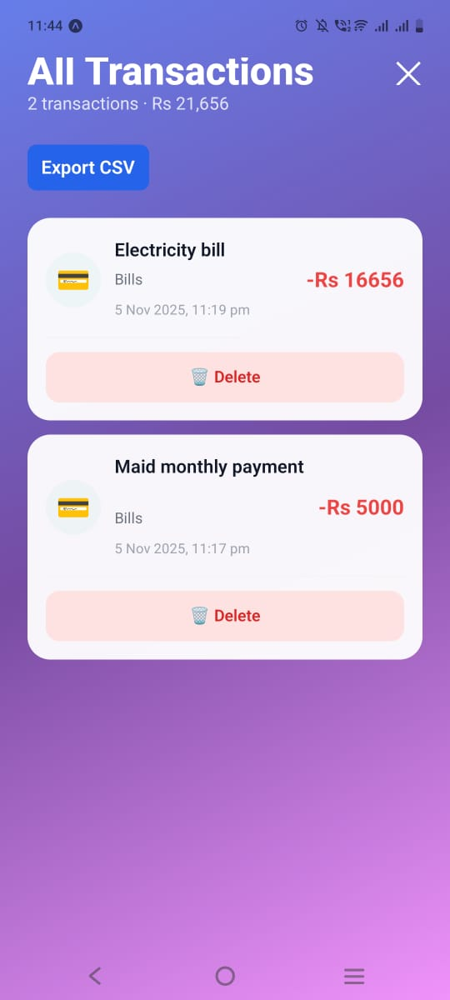

# 💰 PennyPilot

**Track smart · Stay on budget**

A beautiful, modern expense tracking app built with React Native (Expo) and Firebase. Track your daily expenses, set budgets, and visualize your spending with interactive charts. Each user has their own secure, isolated data with Firebase Authentication.


---

## 📸 Screenshots

<p align="center">
  
  
  
  
</p>

---

## ✨ Features

### 🔐 Authentication
- **Email/Password authentication** with Firebase Auth
- **Phone OTP authentication** with Firebase reCAPTCHA
- **Password reset** via email link
- **Secure user registration** with password validation (min 6 characters)
- **Beautiful login/register screens** with gradient UI
- **Auto-redirect** based on authentication state
- **User data isolation** - Each user's data is completely separate
- **Logout functionality** with confirmation dialog

### 🏠 Dashboard
- **Real-time spending overview** - See today's spending at a glance
- **Quick stats** - Track transactions, daily budget, and budget usage
- **Quick category buttons** - Fast expense entry with one tap
- **Recent transactions** - View your last 5 transactions with category icons
- **User-specific data** - All data scoped to authenticated user
- **Profile menu** - Quick access to logout and data refresh

### 📝 Transaction Management
- **Quick add** with amount presets (100, 500, 1000, 5000)
- **9 default categories** with beautiful icons and colors
  - 🍽️ Food | 🚗 Transport | 🛍️ Shopping | 💳 Bills
  - ⚕️ Health | 🎬 Entertainment | ✈️ Travel | 📚 Education | 📦 Misc
- **5 payment methods** - Cash, Bank, Card, UPI/EasyPaisa, Wallet
- **Optional notes** for each transaction
- **Delete transactions** with confirmation
- **CSV export** - Export all transactions to CSV file

### 📊 Reports & Analytics
- **Interactive pie chart** - Visualize top 5 spending categories
- **Time range filters** - View Day, Week, or Month data
- **Category breakdown** - Detailed spending by category with percentages
- **Budget progress tracking** - Visual progress bars for each category
- **CSV export options**:
  - 📊 Export current period (Day/Week/Month)
  - 📅 Custom date range export with date picker
- **Color-coded alerts**:
  - 🟢 Green: Safe (under 80%)
  - 🟡 Orange: Warning (80-100%)
  - 🔴 Red: Over budget!

### 💰 Budget Management
- **Monthly income** setup
- **Overall monthly budget** tracking
- **Category-specific budgets** - Set individual limits for each category
- **Real-time budget monitoring** with progress visualization

### ⚙️ Settings
- Configure monthly income and budget
- Set individual category budgets
- Customize reminder time (default: 2:00 AM)
- **User email display** and logout functionality
- All data synced with Firebase Firestore

### ⚡ Performance & Caching
- **React Query (TanStack Query)** - Smart data caching
- **AsyncStorage persistence** - Cache survives app restarts
- **Instant loading** - <50ms from cache
- **Offline-first** - Full functionality without internet
- **Auto-refresh** - Smart background updates
- **Manual refresh** - Clear cache button in profile menu

---

## 🎨 Design

- **Modern gradient UI** - Beautiful purple-pink gradients throughout
- **Glass-morphism effects** - Frosted glass cards and buttons
- **Clean, minimalist design** - No clutter, just what you need
- **Smooth animations** - Delightful user experience
- **Category-based colors** - Visual distinction for spending categories
- **Responsive layout** - Works on all screen sizes
- **Native date picker** - Platform-specific date selection
- **Bottom sheet modals** - Smooth, native-feeling interactions

---

## 🛠️ Tech Stack

- **Framework**: React Native with Expo (SDK 54)
- **Language**: TypeScript
- **Authentication**: Firebase Authentication (Email/Password + Phone OTP)
- **Database**: Firebase Firestore (offline-first, user-scoped)
- **Caching**: TanStack Query (React Query) + AsyncStorage
- **Charts**: react-native-chart-kit
- **Navigation**: Expo Router (file-based routing)
- **State Management**: React Context API + React Query
- **Styling**: React Native StyleSheet with LinearGradient
- **Date Picker**: @react-native-community/datetimepicker
- **File System**: expo-file-system + expo-sharing
- **Currency**: Pakistani Rupees (PKR)

---

## 📦 Installation & Setup

### Prerequisites

- Node.js 18+ installed
- npm or yarn
- Expo CLI (`npm install -g expo-cli`)
- Firebase project with Authentication and Firestore enabled

### Quick Start

```bash
# Clone the repository
git clone https://github.com/yourusername/pennypilot.git
cd pennypilot

# Install dependencies
npm install

# Configure Firebase
# Create env/firebase.ts with your Firebase config
# See INSTALLATION.md for details

# Start the development server
npx expo start
```

### Firebase Configuration

1. Create a Firebase project at [console.firebase.google.com](https://console.firebase.google.com)
2. Enable Authentication (Email/Password and Phone)
3. Create a Firestore database
4. Copy your Firebase config to `env/firebase.ts`:

```typescript
export const FIREBASE_CONFIG = {
  apiKey: "your-api-key",
  authDomain: "your-project.firebaseapp.com",
  projectId: "your-project-id",
  storageBucket: "your-project.appspot.com",
  messagingSenderId: "your-sender-id",
  appId: "your-app-id"
};
```

5. Set up Firestore security rules (see [FIRESTORE_SECURITY_RULES.md](FIRESTORE_SECURITY_RULES.md))

---

## 📚 Documentation

- **[INSTALLATION.md](INSTALLATION.md)** - Complete setup guide
- **[AUTHENTICATION_SETUP.md](AUTHENTICATION_SETUP.md)** - Authentication implementation
- **[FIRESTORE_SECURITY_RULES.md](FIRESTORE_SECURITY_RULES.md)** - Security rules
- **[CACHING_IMPLEMENTATION.md](CACHING_IMPLEMENTATION.md)** - Caching strategy
- **[PRODUCT_REQUIREMENTS.md](PRODUCT_REQUIREMENTS.MD)** - Product requirements
- **[DESIGN_SUMMARY.md](DESIGN_SUMMARY.md)** - Design system

---

## 🚀 Features Checklist

### Authentication ✅
- [x] Email/Password authentication
- [x] Phone OTP authentication
- [x] Password reset via email
- [x] User data isolation
- [x] Logout functionality
- [x] Auto-redirect based on auth state

### Core Features ✅
- [x] Add transactions
- [x] Delete transactions
- [x] View all transactions
- [x] Category management
- [x] Payment method tracking
- [x] Notes for transactions

### Analytics & Reports ✅
- [x] Interactive pie charts
- [x] Time range filters (Day/Week/Month)
- [x] Category breakdown
- [x] Budget tracking
- [x] CSV export (filtered + custom range)
- [x] Visual budget progress

### Performance ✅
- [x] React Query caching
- [x] AsyncStorage persistence
- [x] Offline-first functionality
- [x] Auto cache invalidation
- [x] Manual refresh option

### UI/UX ✅
- [x] Modern gradient design
- [x] Glass-morphism effects
- [x] Native date picker
- [x] Bottom sheet modals
- [x] Profile menu
- [x] Smooth animations

### Future Enhancements 🔮
- [ ] Edit transactions
- [ ] Recurring expenses
- [ ] Budget recommendations (AI)
- [ ] Dark mode
- [ ] Push notifications
- [ ] Multiple currency support
- [ ] Income tracking
- [ ] Savings goals

---

## 🏗️ Project Structure

```
pennypilot/
├── app/
│   ├── (tabs)/          # Tab navigation screens
│   │   ├── index.tsx    # Home/Dashboard
│   │   ├── reports.tsx  # Reports & Analytics (moved from root)
│   │   └── settings.tsx # Settings
│   ├── add-transaction.tsx
│   ├── transactions.tsx
│   ├── login.tsx
│   ├── register.tsx
│   ├── phone-register.tsx
│   ├── reset-password.tsx
│   └── _layout.tsx      # Root layout with auth
├── components/
│   ├── themed-text.tsx
│   └── export.tsx       # Export component
├── contexts/
│   └── AuthContext.tsx  # Authentication context
├── hooks/
│   └── use-cached-data.ts  # React Query hooks
├── lib/
│   ├── firebase.ts         # Firestore operations
│   ├── firebase-init.ts    # Firebase initialization
│   └── query-client.ts     # React Query config
├── env/
│   └── firebase.ts      # Firebase configuration
├── screenshots/         # App screenshots
└── docs/               # Documentation
```

---

## 🔒 Security

- **User data isolation** - Firestore security rules ensure users can only access their own data
- **Firebase Authentication** - Secure token-based authentication
- **No hardcoded credentials** - All sensitive data in environment files
- **Password validation** - Minimum 6 characters required
- **Secure cache clearing** - Cache cleared on logout

See [FIRESTORE_SECURITY_RULES.md](FIRESTORE_SECURITY_RULES.md) for detailed security rules.

---

## 🤝 Contributing

Contributions are welcome! Please feel free to submit a Pull Request.

1. Fork the repository
2. Create your feature branch (`git checkout -b feature/AmazingFeature`)
3. Commit your changes (`git commit -m 'Add some AmazingFeature'`)
4. Push to the branch (`git push origin feature/AmazingFeature`)
5. Open a Pull Request

---

## 📝 License

MIT License - see [LICENSE](LICENSE) file for details.

---

## 📧 Contact

For questions or support, please open an issue on GitHub.

---

**Built with ❤️ using React Native, Expo & Firebase**

Track smart · Stay on budget 💰
